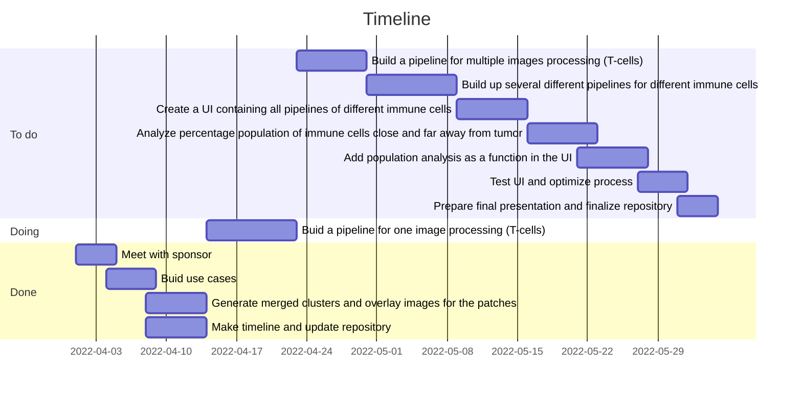

# Digital_segmentation_BRCA_547_Capstone

## Use Case
Automate the process by building a digital pipeline for multiple images to analyse like done for one test case.

Pipeline only for TILS so far. But how to separate different classes of immune cells i.e., macrophages and lymphocytes.

Following this we need to analyze percentage populations of immune cells close to tumor and far away from tumor boundaries.

Based on this, we need to reiterate if a supervised model is necessary or not.

## Timeline

